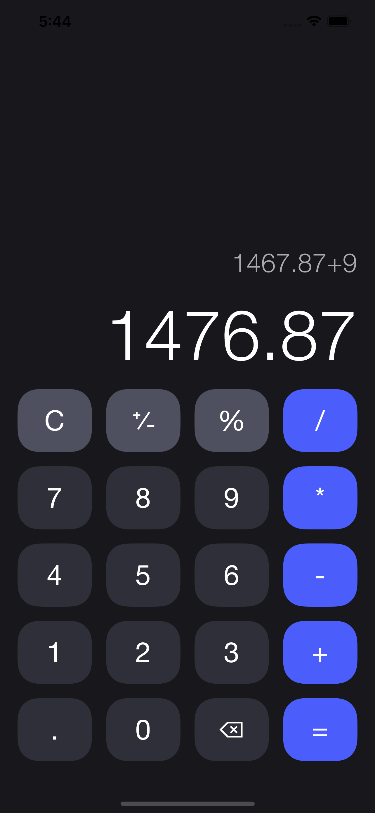
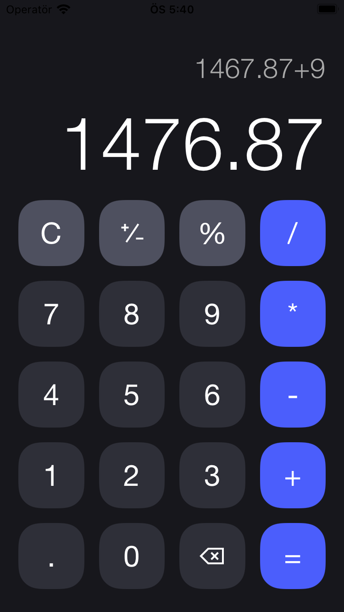
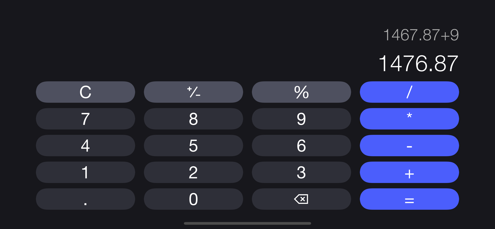
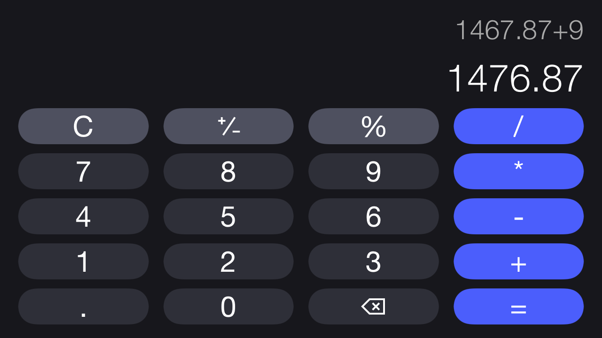
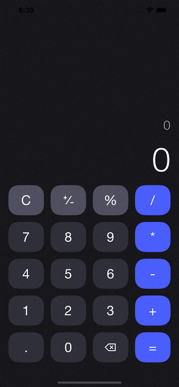
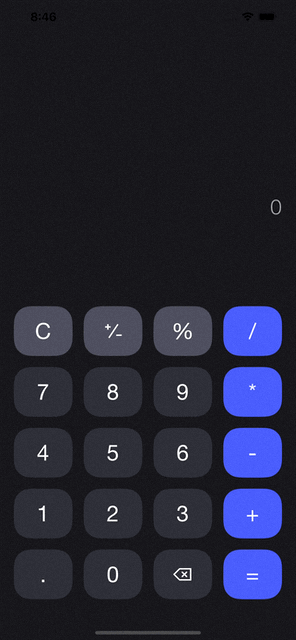

# Calculator App

# **Auto Layout**
- Used stack view for all key rows and displays
- Created constraint variations for horizontal orientation (compact height)
- Used height constraints and pinning
 

| iPhone 13 Pro Max  | iPhone SE (2nd generation) |
| ------------- | ------------- |
|  |   |
|   |  |

# **How It Works?**
- Puts into display the last arithmetic operation button tapped 
- Deletes "0" if user taps another digit after zero, except decimal numbers (0.5, 0.8 etc.)
- Applies plus-minus and percent operations to last operand
- Shows the last operation above the operation display 
- Uses auto-shrink font size and line break
 

| Arithmetic Operations  | Auto Shrink and Line Break | Percent and Plus-Minus Key  | Handling "0"s |
| ------------- | ------------- | ------------- | ------------- |
|  |   |   |   |

# **MVC Pattern**
- There is no logic or data in view and controller
- Calculator Model(Calculator/Model/Calculator.swift) contains all the things about input validity and arithmetic operations 
- Controller(Calculator/Controller/ViewController.swift) calls methods of calculator model and use its outputs in IBActions and includes IBOutlets
- View(Calculator/Controller/Main.Storyboard) is created with Storyboard
